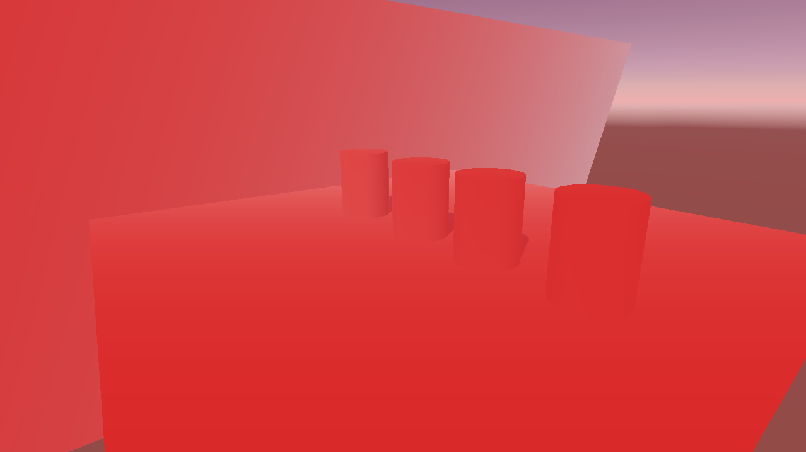

# DepthFog
A fog ImageEffect for unity

 There are 4 pattern:Gaussin,Linear,Exp and Exp2.   
 You can switch between them from the material editor.

 
                  Gaussian

 
                  Linear
 
                  Exp
 
                  Exp2
 
 
